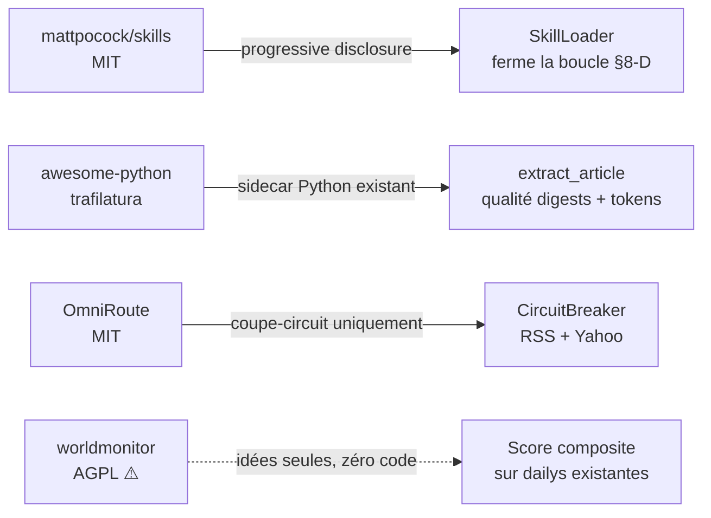

# Analyse de veille — 8 repos externes vs CatDesk

> Date : 2026-08-16 · Base : `master` @ `d21e910` (v0.1.3, modèle unique `qwen3:14b`)
> Objet : évaluer 8 repos proposés et dire lesquels méritent du code dans CatDesk.
> Ce document garde les **traces de raisonnement** (hypothèse → vérification → verdict),
> y compris les pistes rejetées.

---

## 1. Méthode d'évaluation

Une idée n'entre pas dans CatDesk parce qu'elle est populaire. Elle entre si elle passe
**cinq filtres**, dans cet ordre — un échec sur les deux premiers arrête l'examen :

| #   | Filtre                 | Question posée                                                                                         |
| --- | ---------------------- | ------------------------------------------------------------------------------------------------------ |
| 1   | **Licence**            | Peut-on s'en inspirer / en copier du code sans contaminer un binaire distribué ?                       |
| 2   | **Local-first**        | Ça survit sans réseau, sans clé d'API, sans compte ? (contrainte fondatrice du projet)                 |
| 3   | **Budget 10 Go VRAM**  | Ça consomme du contexte / de la VRAM en plus, ou ça en libère ?                                        |
| 4   | **Mission réelle**     | Ça sert la mission recentrée (« questions sur les articles + recherche »), pas une feature orpheline ? |
| 5   | **Coût d'intégration** | Combien de fichiers touchés, et est-ce que la brique existe déjà à moitié ?                            |

Le filtre 3 est le plus discriminant et le plus souvent oublié : sur cette machine, **le
contexte est une ressource rare au même titre que la VRAM**. Toute idée qui gonfle le
system prompt est un coût permanent payé à chaque tour de conversation.

---

## 2. Faits vérifiés (API GitHub, 2026-08-16)

Les READMEs de ce genre de projets sont souvent auto-promotionnels — j'ai donc requêté
l'API plutôt que de faire confiance aux chiffres affichés. **Ils sont exacts.**

| Repo                               |       ★ | Licence         | Langage    | Dernier push |
| ---------------------------------- | ------: | --------------- | ---------- | ------------ |
| `codecrafters-io/build-your-own-x` | 540 239 | — (CC0 annoncé) | Markdown   | 2026-07-14   |
| `sindresorhus/awesome`             | 496 523 | CC0-1.0         | —          | 2026-06-30   |
| `vinta/awesome-python`             | 314 304 | NOASSERTION     | Python     | 2026-08-16   |
| `mattpocock/skills`                | 219 192 | **MIT**         | Shell      | 2026-08-16   |
| `koala73/worldmonitor`             |  82 377 | **AGPL-3.0** ⚠️ | TypeScript | 2026-08-16   |
| `diegosouzapw/OmniRoute`           |  49 102 | **MIT**         | TypeScript | 2026-08-16   |
| `hasaneyldrm/exercises-dataset`    |  19 742 | NOASSERTION     | HTML       | 2026-07-16   |
| `EvanLi/Github-Ranking`            |  11 912 | MIT             | Python     | 2026-08-16   |

> ⚠️ **Le fait le plus important du tableau** : `worldmonitor` est en **AGPL-3.0**.
> C'est le repo le plus proche de CatDesk techniquement — et c'est précisément celui
> dont on **ne peut pas** copier une ligne. Voir §3.2.

---

## 3. Analyse repo par repo

### 3.1 `mattpocock/skills` — 🟢 **Fort. À faire.**

**Ce que c'est (vérifié)** : une collection de skills au format `SKILL.md` (frontmatter
`name` / `description` + corps Markdown), installables via plugin Claude Code ou
`npx skills@latest add`. Philosophie affichée : _« small, easy to adapt, and composable.
They work with any model »_. MIT.

**Hypothèse de départ** : « CatDesk n'a pas de skills, `CATDESK-CONCEPTS-AVANCES.md`
le note en ⬜ deux fois (§1 et §8) — donc c'est un chantier vierge à démarrer. »

**Vérification dans le code** → **hypothèse fausse, et c'est bien plus intéressant.**

CatDesk génère **déjà** des `SKILL.md`. [`proposeSkills.ts`](../../packages/agent-runtime/src/playbook/proposeSkills.ts)
transforme les stratégies gagnantes (≥ 4 essais, ≥ 75 % de succès) en brouillons de skill,
avec exactement le même format frontmatter que Pocock :

```markdown
---
name: auto-recherche-actu
description: Procédure éprouvée pour les tâches de type « … » (brouillon auto-généré).
status: draft
---
```

Et [`EvolutionDaemon.ts:87-95`](../../packages/agent-runtime/src/playbook/EvolutionDaemon.ts#L87-L95)
les écrit sur disque dans `skill-drafts/`.

**Puis j'ai cherché qui les relit** :

```
$ grep -rni "skill" --include=*.ts packages/agent-runtime/src/ | grep -v playbook/
(aucun résultat)
```

**→ Le diagnostic réel : la boucle est ouverte.** CatDesk sait _écrire_ des skills mais
n'a **aucun moyen d'en lire une**. Les brouillons s'accumulent dans un dossier que rien
ne consomme. Le §8 du doc concepts est ✅ à moitié seulement, et ce n'est pas la moitié
qu'on croit : la partie difficile (apprendre des traces) est faite, la partie triviale
(recharger le fichier) manque.

**Le vrai problème que ça résout, et qui coûte cher aujourd'hui.**
[`systemPrompt.ts`](../../packages/agent-runtime/src/prompts/systemPrompt.ts) est un
monolithe de 81 lignes contenant un bloc « Choix des outils » écrit à la main :

```
- Question sur un article […] → search_dailies EN PREMIER
- Approfondir un sujet […] → read_webpage
- Actus tech du moment (hors dailys) → fetch_tech_news
- Voir / lister les tâches récurrentes → list_scheduled_tasks
… (8 puces)
```

**68 outils sont enregistrés** (`registerTools.ts`), 8 sont documentés dans le prompt.
Ce bloc est payé **à chaque tour**, pour tous les outils, même quand la question porte
sur la météo. C'est le contre-exemple parfait du §2 « context engineering » du doc
concepts, dans le fichier même qui devrait l'appliquer.

**Ce que Pocock apporte concrètement** : la discipline de _progressive disclosure_ —
seul le couple `name` + `description` est en contexte permanent ; le corps du skill
n'est chargé que si le modèle le demande.

**Proposition — `SkillLoader` (≈ 3 fichiers)** :

1. `SkillStore.ts` — lit `skills/*.md` + `skill-drafts/*.md` (les seconds désactivés
   tant que `status: draft`, ce qui préserve le human-in-the-loop déjà en place).
2. `buildSystemPrompt` reçoit un `skillIndex: {name, description}[]` → une ligne par
   skill au lieu du pavé figé.
3. Outil `load_skill(name)` (69ᵉ) → renvoie le corps. Risque `low`, auto-approuvé :
   c'est une lecture d'un fichier local produit par l'app.

**Gain** : le bloc « choix des outils » sort du prompt permanent et devient 3-4 skills
chargés à la demande ; les brouillons auto-générés deviennent enfin utilisables après
relecture humaine ; le §8-D boucle. **C'est la recommandation n°1 du document.**

**Réserve honnête** : la _progressive disclosure_ suppose que le modèle décide d'appeler
`load_skill` au bon moment. `qwen3:14b` en `think:false` est moins fiable là-dessus que
les modèles frontier pour lesquels Pocock conçoit. **Mitigation** : ne pas tout basculer
d'un coup — garder en dur les 2-3 règles vitales (`search_dailies` en premier, jamais
d'appel d'outil écrit en texte) et n'externaliser que les procédures longues et rares.

---

### 3.2 `koala73/worldmonitor` — 🟡 **Inspiration architecturale uniquement. Ne pas copier.**

**Ce que c'est (vérifié)** : dashboard de veille géopolitique temps réel. Stack :
**Tauri 2 + sidecar Node.js + Ollama en local**, TypeScript, agrégation de flux news,
radar finance (actions/commodities/crypto), synthèses IA, serveur MCP, apps desktop
Windows/macOS/Linux. 82 k ★, AGPL-3.0.

**C'est le jumeau technique de CatDesk.** Même stack au composant près, même domaine
produit (news + finance + digest LLM), même contrainte revendiquée (« local AI via
Ollama, no API keys required »). Un projet à 82 k ★ valide _a posteriori_ les choix
d'architecture de CatDesk — ce n'est pas rien.

**Hypothèse de départ** : « même stack, même domaine → c'est la mine d'or du lot, on
peut aller y piocher des composants. »

**Vérification → bloquée au filtre 1.** L'**AGPL-3.0** est le copyleft le plus fort :
il se déclenche même sur usage réseau. Réutiliser leur code obligerait CatDesk à publier
**l'intégralité** de ses sources sous AGPL. Pour une app desktop distribuée en installeur
(`catdesk-releases`), c'est une décision de licence structurante — pas un détail.

**Règle de travail qui en découle** : lire pour comprendre, jamais copier-coller.
Les idées et l'architecture ne sont pas couvertes par le copyright ; le code source, si.

**Idées transférables (ré-implémentation propre uniquement)** :

- **Le « Country Instability Index » (score composite v8)** est le concept le plus
  intéressant. CatDesk publie 7 journaux + 6 sujets + 1 synthèse par jour et n'en tire
  **aucun signal agrégé** — l'utilisateur lit ou ne lit pas. Un score dérivé des dailys
  déjà en base (densité d'un thème, accélération vs 7 jours glissants) donnerait un
  widget dashboard **sans un seul appel LLM supplémentaire** : c'est du calcul sur des
  lignes Supabase existantes. Bon rapport valeur/VRAM.
- **La « cross-stream correlation »** (converger news + marché) : CatDesk a déjà les
  deux flux séparés ([`MarketService`](../../packages/agent-runtime/src/market/MarketService.ts)
  et les dailys) et ne les croise jamais.
- **Six variantes de site depuis une codebase unique** : intéressant en soi, mais hors
  sujet pour un desktop mono-produit. **Écarté.**

**Verdict** : source d'inspiration produit de premier ordre, **zéro ligne de code**.
Je recommande d'ajouter cette contrainte de licence noir sur blanc si le repo est
consulté à nouveau.

---

### 3.3 `vinta/awesome-python` — 🟢 **Une trouvaille concrète et sous-estimée.**

**Ce que c'est** : liste curée, aucune techno propre. La valeur est celle d'un annuaire.

**Hypothèse** : « liste générique, probablement rien d'actionnable. »

**Vérification → une trouvaille réelle, mais pas celle que je croyais.**

> ⚠️ **Correction d'une première version de ce document.** J'avais d'abord écrit que
> l'extraction se faisait « à la regex, sans retrait du boilerplate, et que tout le
> pipeline de digest héritait de ce déchet ». **C'est faux et je l'ai vérifié après
> coup** : [`extractReadableText`](../../packages/agent-runtime/src/tools/web/ReadWebpageTool.ts#L91-L107)
> fait un vrai débruitage (ciblage `<article>`/`<main>`, retrait
> `header/nav/aside/footer`, filtre de prose ligne à ligne), il est testé, et
> `enrichArticleTexts` l'utilise — donc **le pipeline presse est correctement
> alimenté**. Le défaut réel est ailleurs, plus étroit et plus net.

**Le défaut réel : les deux chemins de lecture web ne sont pas alignés.**

| Chemin                                                                                                                                      | Fonction utilisée     | Débruitage ? |
| ------------------------------------------------------------------------------------------------------------------------------------------- | --------------------- | ------------ |
| Pipeline presse (`enrichArticleTexts` → `pressDigest`, `customJournalDigest`)                                                               | `extractReadableText` | ✅ oui       |
| **Outil `read_webpage` appelé par l'agent** ([`execute` L226-232](../../packages/agent-runtime/src/tools/web/ReadWebpageTool.ts#L226-L232)) | `htmlToText`          | ❌ **non**   |

`ReadWebpageTool.execute` appelle `htmlToText` (retrait des balises uniquement), alors
que la fonction de débruitage vit **dans le même fichier**. Or le system prompt désigne
explicitement cet outil pour « approfondir un sujet, vérifier une source ou lire une
page » : **le chemin interactif de l'agent est moins bon que le chemin batch**, et c'est
celui que l'utilisateur déclenche en posant une question. Menus, bandeaux cookies et
« à lire aussi » partent au LLM, jusqu'à `max_chars = 20 000`.

**Le second angle mort, celui où trafilatura gagne vraiment.** `extractReadableText`
renvoie `''` quand rien ne ressemble à de la prose — comportement voulu et testé
(« paywall, mur de cookies, accueil »). En face, `enrichArticleTexts` abandonne
silencieusement sous 200 caractères et retombe sur l'extrait RSS :

```ts
const text = extractReadableText(html);
if (text.length < 200) return; // ← repli muet sur l'extrait RSS
```

Chaque page dans ce cas est un article résumé **à partir de deux lignes de flux RSS** au
lieu de son contenu. C'est exactement la classe de pages que `trafilatura` récupère (il
gère les structures que l'heuristique `<article>`/prose rate). Le filtre
`looksLikeProse` a d'ailleurs un biais connu : seuil à 40 % de mots capitalisés et
ponctuation obligatoire → il jette les intertitres, les phrases courtes et les listes.

**Pourquoi ça vaut le coup malgré tout** : la revue de presse est _le_ produit, et sur
10 Go de VRAM chaque millier de tokens de menu est pris sur le budget `num_ctx` du
contenu utile.

**La solution est déjà à moitié en place** : `trafilatura` (état de l'art du débruitage)
est **Python**, et CatDesk a **déjà un sidecar Python** avec un chemin JSON-RPC établi
([`packages/ocr-vision/`](../../packages/ocr-vision/) : pypdf, python-docx, opencv,
faster-whisper).

**Mesure faite (page d'article synthétique : nav + bandeau cookies + article +
« à lire aussi » + footer, 1 009 car. de HTML)** :

| Extraction                                   | Texte rendu | Bruit conservé                                                |
| -------------------------------------------- | ----------: | ------------------------------------------------------------- |
| `htmlToText` — ce que faisait `read_webpage` |    711 car. | cookies, mentions légales, « à lire aussi », menu — **les 4** |
| `extractReadableText` — heuristique          |    392 car. | aucun                                                         |
| `trafilatura` — sidecar                      |    442 car. | aucun                                                         |

Deux enseignements chiffrés :

1. `read_webpage` envoyait **~45 % de bruit** au LLM, sans perdre un mot d'article
   une fois aligné sur l'heuristique. C'est le gain le plus net, et il est gratuit.
2. Les **50 caractères d'écart** entre trafilatura et l'heuristique sont **le titre
   H1 de l'article** : `looksLikeProse` le rejette faute de ponctuation de phrase.
   Le biais soupçonné plus haut est donc réel et démontré — l'heuristique perd le
   titre, c'est-à-dire l'information la plus dense de la page.

**Proposition en deux temps** :

1. **Gratuit, sans dépendance** — `ReadWebpageTool.execute` utilise `extractReadableText`,
   avec repli sur `htmlToText` si le résultat est vide. Aligne les deux chemins.
2. **`trafilatura>=1.12`** dans `requirements.txt` → méthode sidecar
   `web.extract_article` → utilisée par les deux chemins, avec **repli sur l'existant**
   si le sidecar est absent (l'installeur ne doit jamais régresser). Pas de VRAM, pas de
   dépendance système.

**Autres candidats notés, non retenus pour l'instant** : `feedparser` (le parsing RSS
maison fonctionne, ne pas réparer ce qui marche), `diskcache` (le cache 60 s de
`SharedDailyReader` suffit), `meilisearch` (BM25 + dense sont déjà là dans
[`VectorStore`](../../packages/agent-runtime/src/memory/VectorStore.ts) — ajouter un
service serait un recul sur le local-first).

---

### 3.4 `diegosouzapw/OmniRoute` — 🟠 **Thèse opposée. Deux briques à retenir.**

**Ce que c'est (vérifié)** : passerelle IA MIT, 340 fournisseurs, 1 200 modèles, 19
stratégies de routage, mode « auto » scorant 14 facteurs, compression de tokens
(12 moteurs, 15-95 % d'économie), coupe-circuits, serveur MCP à 109 outils. 49 k ★.

**Hypothèse** : « CatDesk a un `ModelRouter` — il y a sûrement des stratégies à
importer. »

**Vérification → hypothèse à retourner complètement.**

D'abord, CatDesk **va dans la direction inverse, et volontairement**. La v0.1.3 a
_supprimé_ le palier `qwen2.5:7b` pour ne garder qu'un modèle. Conséquence lue dans le
code : [`resolveModel`](../../packages/agent-runtime/src/llm/ModelRouter.ts#L155-L158)
retourne désormais toujours `'Auto : modèle principal'`, puisque `light` est absent.

> **Constat annexe, à traiter séparément** : `ModelRouter` et ses trois familles de
> regex (`COMPLEX_HINTS`, `ACTION_HINTS`, `RESEARCH_HINTS`) sont **du code mort depuis
> v0.1.3**, sauf si `CATDESK_MODEL_SMALL` est positionné à la main. Ce n'est pas un bug
> — le garde-fou est correct — mais quelqu'un le lira un jour en croyant que le routage
> est actif. Une note en tête de fichier éviterait ça.

Le routage multi-fournisseurs d'OmniRoute est donc **structurellement inapplicable** :
340 fournisseurs cloud contre un Ollama sur `127.0.0.1`. Filtre 2, échec net.

**Mais deux sous-composants survivent à l'analyse** :

1. **Coupe-circuit par source (le plus utile).** CatDesk a
   [`withRetry`](../../packages/agent-runtime/src/lib/retry.ts) (backoff linéaire) et
   c'est tout. Il n'existe **aucun coupe-circuit** : un journal RSS mort ou l'API Yahoo
   Finance en rade est re-sollicité à chaque cycle, indéfiniment. Un `CircuitBreaker`
   partagé (N échecs → mise en sommeil de la source, réessai espacé) profiterait à
   `PressFeedStore`, `YahooQuoteSource` et `MarketPoller` d'un coup. **Petit, testable,
   sans dépendance.**
2. **La compression de tokens** : le principe est pertinent vu la contrainte VRAM, mais
   les 12 moteurs empilés d'OmniRoute sont hors de proportion, et compresser dégrade la
   compréhension d'un 14B bien plus que celle d'un modèle frontier. **La bonne réponse
   au même problème, c'est §3.3 (mieux extraire)** — enlever le bruit avant de le
   compresser vaut mieux que compresser le bruit. Idée notée, **pas retenue**.

**Note** : leur serveur MCP montre qu'exposer les outils CatDesk via MCP est faisable —
piste à instruire séparément, hors périmètre de cette veille.

---

### 3.5 `EvanLi/Github-Ranking` — 🔵 **Un patron d'automatisation, pas une techno.**

**Ce que c'est (vérifié)** : classements GitHub régénérés **quotidiennement** par un cron
(`auto_run.sh` + scripts Python), sortie en Markdown commitée dans le repo (`Top100/`).
Le repo était à jour à `2026-08-16T04:07` au moment de l'analyse.

**Ce qui mérite réflexion** : le patron « **un runner toujours allumé produit la donnée,
tout le monde la lit** ». Or `docs/SUIVI.md` documente exactement la douleur inverse :
les dailys n'avaient été publiées **qu'une seule fois, le 19 juillet**, parce qu'aucun
poste admin ne tournait en continu. La réponse apportée (2026-07-20) fut « publier depuis
n'importe quel poste » + RPC `publish_daily_if_missing`.

**Question honnête que ça pose** : un cron GitHub Actions n'aurait-il pas été plus
robuste qu'un scheduler opportuniste réparti sur des postes allumés au hasard ?

**Réponse après examen : non, et c'est structurel.** La génération des dailys exige un
**LLM local** (`digestLlm.ts`, `globalSynthesis.ts`). Un runner CI n'a pas d'Ollama ;
il faudrait une API cloud, ce qui casse le local-first et introduit une clé et un coût.
**La solution actuelle est la bonne** compte tenu des contraintes du projet.

**Ce qui reste utilisable** : leur discipline d'_idempotence quotidienne_ est déjà égalée
(contrainte unique + `on conflict do nothing`). Le seul écart résiduel est la fenêtre de
course connue et documentée (génération redondante occasionnelle) — compromis assumé et
validé. **Rien à changer.** Valeur du repo : avoir servi de contre-épreuve à une décision
d'architecture existante, qui en ressort confirmée.

---

### 3.6 `hasaneyldrm/exercises-dataset` — ⚪ **Hors domaine.**

**Ce que c'est (vérifié)** : 1 324 exercices de fitness, JSON + GIFs, instructions en 10
langues, validé par un JSON Schema Draft 2020-12. Code MIT, **médias © Gym visual**
(d'où le `NOASSERTION` de l'API).

**Hypothèse testée** : « le domaine (fitness) n'a rien à voir, mais y a-t-il un patron
de packaging transposable ? »

**Vérification** : CatDesk ne livre aucun jeu de données statique. L'installeur de 18 Go
contient des **poids de modèles**, pas des données applicatives.

**Le seul enseignement transposable** est la **séparation des licences dans un même
dépôt** : code MIT / médias sous licence tierce, clairement énoncé. Si CatDesk embarque
un jour des données ou des visuels tiers, c'est la bonne pratique. Le JSON Schema
Draft 2020-12 pour valider une donnée livrée est également sain — mais CatDesk valide
déjà ses entrées avec Zod côté TS.

**Verdict : rien à intégrer.** Je le note tel quel plutôt que de fabriquer un lien
artificiel avec le projet.

---

### 3.7 `sindresorhus/awesome` (dossier `/media`) — ⚪ **Aucune valeur technique.**

Des logos et badges SVG (rose `#fc60a8`, police Orbitron), CC0, réutilisables librement.
C'est de l'actif de marque pour listes « awesome ».

**Le seul cas d'usage réel** serait un badge dans le README si CatDesk était un jour
listé dans une liste awesome. Sans rapport avec le produit. **Rien à intégrer.**

---

### 3.8 `codecrafters-io/build-your-own-x` — ⚪ **Pédagogique, pas architectural.**

540 k ★, CC0, aucune automatisation : une liste Markdown de tutoriels « recréez X de
zéro », chaque entrée pointant vers un contenu externe.

**Vérifié** : aucun outillage dans le repo (contrairement à Github-Ranking qui, lui, a
des scripts). C'est une ressource d'apprentissage, sans surface technique.

**Verdict : rien à intégrer.** Utile pour monter en compétence (les sections « moteur de
recherche » et « bases de données » recoupent le RAG local du §4 du doc concepts), pas
pour faire évoluer la codebase.

---

## 4. Synthèse — ce que je retiens, par ordre de priorité



| Prio   | Action                                 | Origine                       | Effort                    | Pourquoi maintenant                                                                        |
| ------ | -------------------------------------- | ----------------------------- | ------------------------- | ------------------------------------------------------------------------------------------ |
| **1**  | `SkillLoader` + outil `load_skill`     | mattpocock/skills             | ~3 fichiers               | Ferme une boucle **déjà à moitié construite** ; allège le system prompt payé à chaque tour |
| **2a** | `read_webpage` → `extractReadableText` | awesome-python (par ricochet) | ~1 fichier                | Aligne le chemin interactif sur le chemin batch, **sans dépendance**                       |
| **2b** | `trafilatura` dans le sidecar OCR      | awesome-python                | ~3 fichiers               | Récupère les pages où l'heuristique abandonne (repli muet sur 2 lignes de RSS)             |
| **3**  | `CircuitBreaker` partagé               | OmniRoute                     | ~1 fichier + branchements | Une source morte boucle indéfiniment aujourd'hui                                           |
| **4**  | Score composite sur les dailys         | worldmonitor (idée)           | Widget + calcul           | Valorise 14 lignes/jour déjà en base, **sans appel LLM**                                   |
| —      | Note « code mort » sur `ModelRouter`   | trouvé chemin faisant         | 3 lignes                  | Évite une mauvaise lecture future                                                          |

**Rejeté explicitement** — et pourquoi, pour ne pas y revenir :

- **Routage multi-modèles** (OmniRoute) → contredit frontalement la décision v0.1.3
  « un seul modèle, le plus fort ».
- **Compression de tokens** (OmniRoute) → mieux extraire (prio 2) traite la même cause
  en amont, sans dégrader la compréhension du 14B.
- **Tout code de worldmonitor** → AGPL-3.0, incompatible avec un installeur distribué.
- **Dailys via cron CI** (Github-Ranking) → pas d'Ollama sur un runner ; casserait le
  local-first. L'architecture actuelle est confirmée.
- **Meilisearch / feedparser / diskcache** → remplaceraient des briques qui fonctionnent.
- **exercises-dataset, awesome/media, build-your-own-x** → hors périmètre technique.

**Observation transversale** : les deux meilleures trouvailles ne sont pas venues des
repos les plus proches du projet. Le jumeau technique (worldmonitor, même stack exacte)
est **inutilisable pour cause de licence**, tandis qu'une simple liste curée
(awesome-python) a révélé le défaut le plus coûteux du produit. La proximité
technologique n'est pas un bon prédicteur de valeur — la licence et le point de douleur
réel le sont.

---

## 5. Suites données (2026-08-16, même journée)

Les trois chantiers techniques ont été implémentés dans la foulée de cette analyse.
**683 tests agent-runtime (+53) + 39 desktop + 7 Python, type-check et lint OK.**

| Chantier            | Livré                                                                             | Fichiers clés                                                                                                                                                                      |
| ------------------- | --------------------------------------------------------------------------------- | ---------------------------------------------------------------------------------------------------------------------------------------------------------------------------------- |
| 1 — SkillLoader     | `SkillStore` + outil `load_skill` (69ᵉ), index `nom — description` dans le prompt | [`skills/SkillStore.ts`](../../packages/agent-runtime/src/skills/SkillStore.ts), [`tools/skills/LoadSkillTool.ts`](../../packages/agent-runtime/src/tools/skills/LoadSkillTool.ts) |
| 2a — Alignement web | `read_webpage` passe par `extractReadableText`, repli `htmlToText`                | [`ReadWebpageTool.ts`](../../packages/agent-runtime/src/tools/web/ReadWebpageTool.ts)                                                                                              |
| 2b — trafilatura    | Méthode sidecar `web.extract_article`, repli silencieux                           | [`web/article_extractor.py`](../../packages/ocr-vision/web/article_extractor.py), [`lib/articleExtract.ts`](../../packages/agent-runtime/src/lib/articleExtract.ts)                |
| 3 — CircuitBreaker  | Coupe-circuit partagé, branché presse + Yahoo                                     | [`lib/CircuitBreaker.ts`](../../packages/agent-runtime/src/lib/CircuitBreaker.ts)                                                                                                  |

## 6. Mesure sur modèle réel : l'index des skills est nuisible sur `qwen3:14b`

La vérification annoncée (« `load_skill` est-il appelé de façon fiable ? ») a été
faite contre l'Ollama local, avec le vrai `SkillStore`, le vrai `buildSystemPrompt`
et les vrais schémas d'outils. **Le résultat a inversé la décision de conception.**

**Banc A/B** — 6 requêtes que 2 skills couvrent, `qwen3:14b`, `think:false`,
`temperature: 0` :

| Configuration                            | Outil appelé                                    |
| ---------------------------------------- | ----------------------------------------------- |
| Prompt **sans** skills (contrôle)        | `search_dailies` **5/6** — comportement correct |
| Prompt **avec** skills (1ʳᵉ formulation) | **0/6** — `content: ""`, aucun outil            |

Le modèle génère bien 34 tokens (`eval_count: 34`) mais ils ressortent en contenu
**vide** sans `tool_calls` : Ollama les consomme comme un appel d'outil malformé et
les jette. `recoverToolCalls` ne peut rien rattraper — il travaille sur le texte du
contenu, et il n'y a pas de texte.

**Isolation** — le coupable est le prompt, pas l'outil :

| Variante                          | Résultat                                 |
| --------------------------------- | ---------------------------------------- |
| Section prompt + outil exposé     | RIEN ×4                                  |
| Section prompt, **outil absent**  | RIEN ×4                                  |
| **Outil exposé, section absente** | `search_dailies` ×4 — aucune dégradation |
| Ni l'un ni l'autre                | `search_dailies` ×4                      |

**Quatre formulations testées**, aucune sûre :

| Formulation                                       | Réponses cassées | `load_skill` appelé |
| ------------------------------------------------- | ---------------: | ------------------: |
| A — impératif « appelle load_skill AVANT d'agir » |          **5/6** |                 0/4 |
| B — information en fin de prompt, sans impératif  |              2/6 |             **3/4** |
| C — puce dans le bloc « choix des outils »        |              2/6 |                 2/4 |
| D — liste nue, aucune consigne                    |              3/6 |                 1/4 |

Même la meilleure casse « Donne-moi les actus tech du moment » — une requête **sans
aucun rapport avec les skills**, qui fonctionnait avant.

**Décision** : l'annonce des skills dans le prompt est **désactivée par défaut**
(`CATDESK_SKILL_INDEX=1` pour la réactiver), avec la formulation B conservée pour le
jour où un modèle la supportera. L'outil `load_skill` **reste toujours enregistré**,
puisqu'il est mesuré inoffensif — et il garde sa valeur : en configuration par défaut,
un skill **nommé explicitement** est chargé correctement **2/2**, avec les bons
arguments, sans perturber les autres requêtes.

> **Ce que cet épisode dit de la méthode.** Le filtre n°3 de la grille (§1) supposait
> qu'un ajout au prompt se paie en tokens. Sur un modèle local de 14B, il peut se
> payer bien plus cher : en capacité d'appel d'outil. La réserve posée au §3.1
> (« moins fiable que les modèles frontier ») était juste dans son principe et très
> en dessous de la réalité dans son ampleur. **Une idée validée par la pratique du
> domaine n'est pas transférable sans mesure sur le modèle qu'on embarque.**

## 7. Ce que la mise en œuvre a fait remonter

Trois défauts trouvés **en vérifiant**, aucun n'était visible à la lecture du code.

**a. Un bug d'encodage que j'ai introduit, sur le chemin le plus critique.**
Node envoie du JSON UTF-8 brut sur stdin (`JSON.stringify` n'échappe pas le
non-ASCII) ; `main.py` lisait avec l'encodage local de Windows (cp1252). Mesuré au
codepoint : `U+00C3 U+00BB` au lieu de `U+00FB` — « août » → « août ». **Toute la
presse française serait partie au LLM en charabia.** Latent depuis toujours (les
méthodes historiques ne transportent que des chemins et du base64) ;
`web.extract_article` est la première à faire passer du texte accentué. Corrigé
par `reconfigure(utf-8)` avant toute lecture, causalité vérifiée dans les deux sens.

> Le garde-fou Python ajouté **ne reproduit pas** la panne — trafilatura répare
> parfois le mojibake par détection de charset, selon le contenu. C'est écrit dans
> sa docstring : un test qui ne peut pas échouer ne protège rien, et le pire des
> cas serait que quelqu'un retire le correctif en se fiant à son vert.

**b. Une robustesse qui ne tenait qu'à la politesse de l'appelé.** Le test de
cascade a montré qu'une exception du sidecar traversait `execute` et faisait
échouer tout l'appel. Ça ne se produisait pas en pratique parce que
`extractArticleViaSidecar` avale ses erreurs — mais le commentaire promettait
« le pipeline ne casse pas », et cette promesse était empruntée. `execute` a
maintenant son propre repli.

**c. Le venv OCR était cassé depuis le 2026-08-02** (15 imports sur 19), donc
l'OCR, le PDF, le docx et Whisper étaient hors service **sans que rien ne le
signale** — `main.py` importe en paresseux, le sidecar démarrait normalement.
Révélé par hasard en installant trafilatura. Réparé (19/19).

## 8. Vérifications restant à faire

- **Deux skills sont désormais livrés avec l'app** (`revue-comparee`,
  `verifier-source`), stagés par `build-release.ps1`. Un skill utilisateur de même
  nom prime, pour qu'une mise à jour n'écrase pas une personnalisation.
- Réessayer l'index si le modèle du bundle change — le banc est reproductible.
- **Build de release complet vérifié** : `tauri build` compile le Rust et produit
  les installeurs MSI + NSIS avec l'ensemble de ces changements. L'app n'a pas été
  lancée en interactif : les mesures passent par le runtime agent, Ollama et le
  sidecar Python directement.
